# 🛒 Asan Bazar

**Asan Bazar** is a modern multilingual online marketplace platform designed for Afghanistan and surrounding regions.  
Users can easily publish products, manage ads, and connect directly with buyers and sellers for secure transactions.  

🌐 **Languages Supported**:  
🇦🇫 Farsi | Pashto | 🇬🇧 English  

---

## ✨ Features

- 🔐 **User Management**: Sign up, login, and profile editing  
- 🛍️ **Product Listings**: Add, edit, and delete products  
- 💬 **Messaging System**: Real-time communication between buyers and sellers  
- 📞 **Contact Options**: Messaging and phone number sharing  
  *(Since online payment systems are not widely used in Afghanistan, direct communication is the core of transactions)*  
- ⭐ **Ratings & Reviews**: Feedback system for sellers and products  
- 🌍 **Multilingual Support**: Farsi, Pashto, and English  
- 📍 **Location-Based Filtering**: Search products by Afghan cities  

---

## 🛠️ Technologies Used

- **Backend**: Django (Python)  
- **Frontend**: HTML, CSS, Bootstrap  
- **Dynamic Interactions**: JavaScript  
- **Database**: SQLite (default choice for simplicity and reliability)  
- **Authentication**: Django Auth + JWT  
- **Deployment**: Heroku / Vercel  

---

## ⚙️ Installation

```bash
# Clone the repository
git clone https://github.com/omidhabib/asan-bazar.git

# Navigate into the project directory
cd asan-bazar

# Create a virtual environment
python -m venv venv
source venv/bin/activate   # Mac/Linux
venv\Scripts\activate      # Windows

# Install dependencies
pip install -r requirements.txt

# Apply migrations (SQLite database)
python manage.py migrate

# Run the server
python manage.py runserver


## 📸 Screenshots

### Login Page
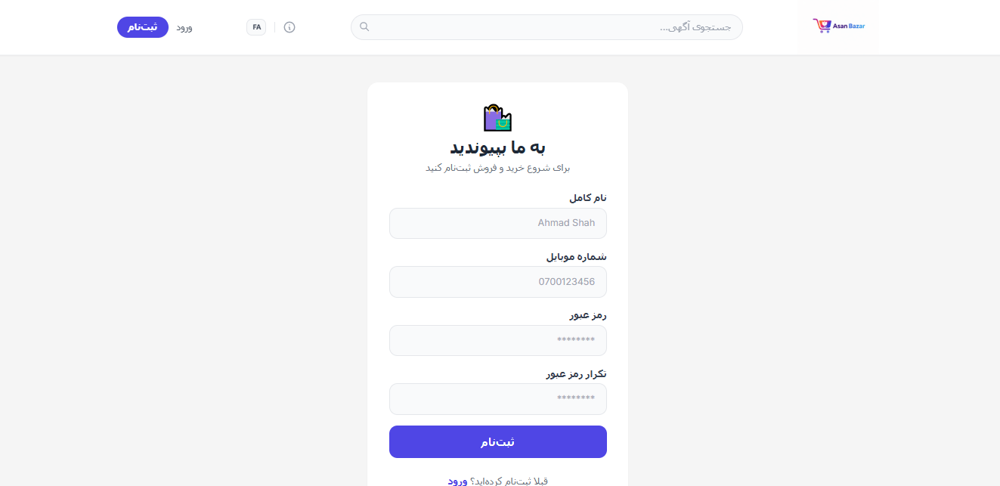

### Product Listing
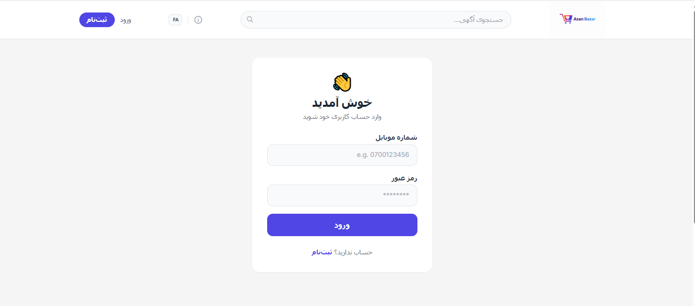

### User Profile
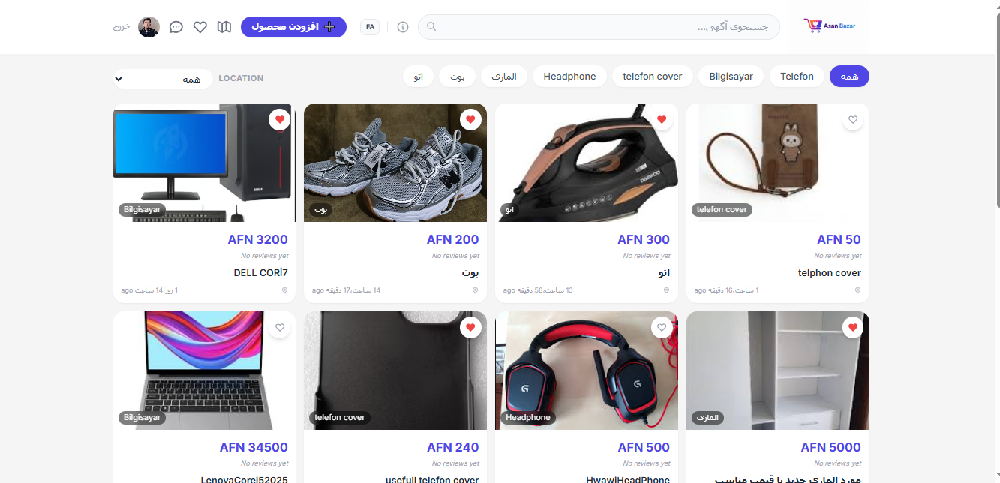

### More Screens
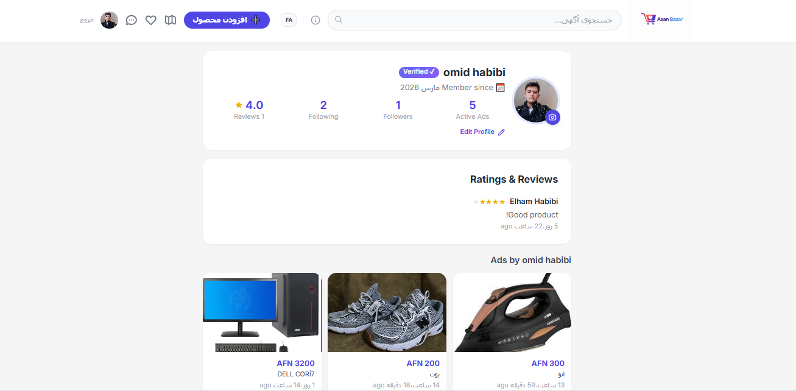
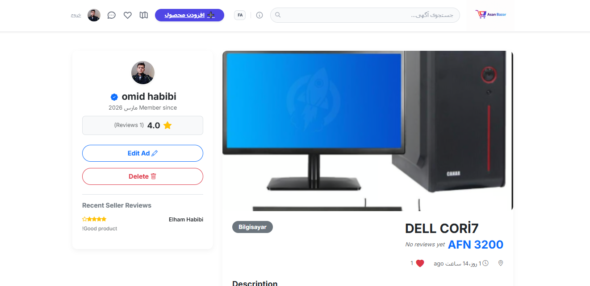
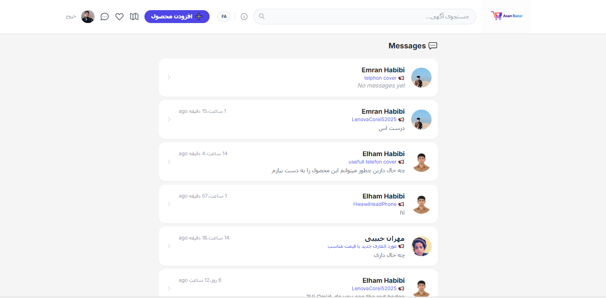
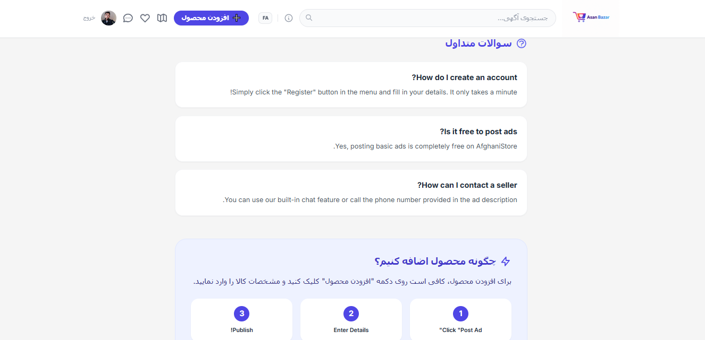
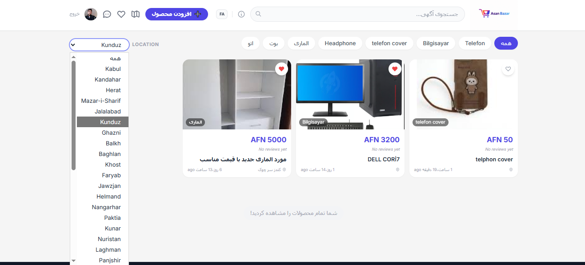

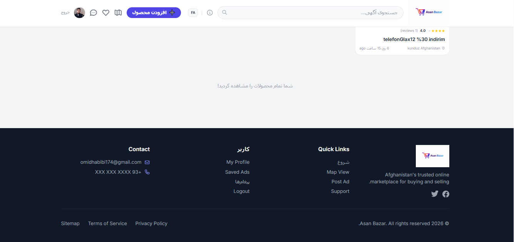
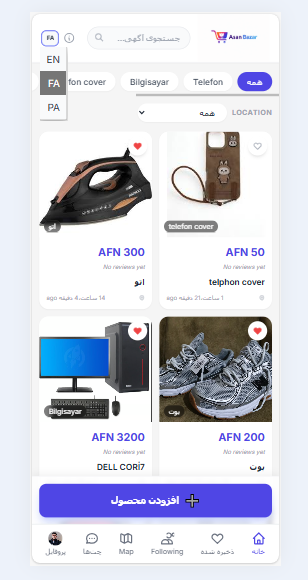
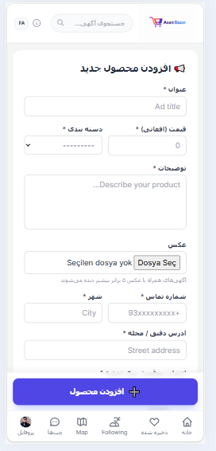


### T1


### T2


